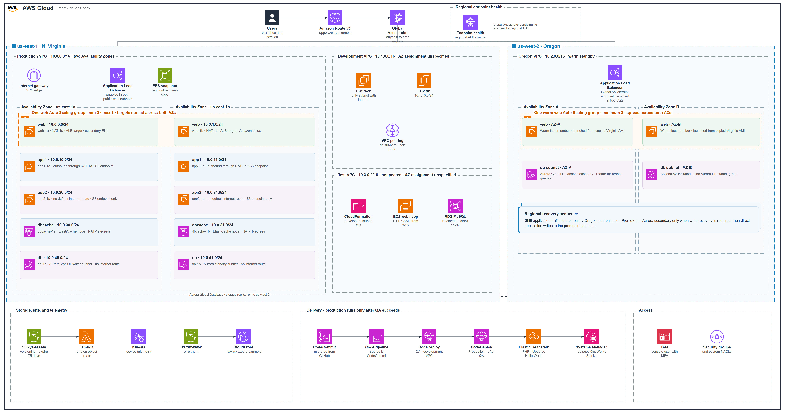

# AWS Projects

AWS portfolio for cloud and DevOps engineering roles. This repository is where I publish the infrastructure and automation that show how I design, secure, and operate workloads on Amazon Web Services.

## marck-devops-corp

A multi-region platform in one Terraform module: production in Virginia, a warm standby in Oregon, a development network peered only for MySQL, and an isolated test stack whose database survives stack deletion.

[Open the project](marck-devops-corp)

## What this work shows

- Network design across Availability Zones, with public and private subnets and controlled outbound access
- Identity and access with least-privilege IAM, MFA for operators, and GitLab OIDC for the pipeline
- Infrastructure as code in Terraform, with remote state and a reviewable plan before apply
- Separate development, test, and production environments

Each project lives in its own folder so it can be reviewed on its own.
